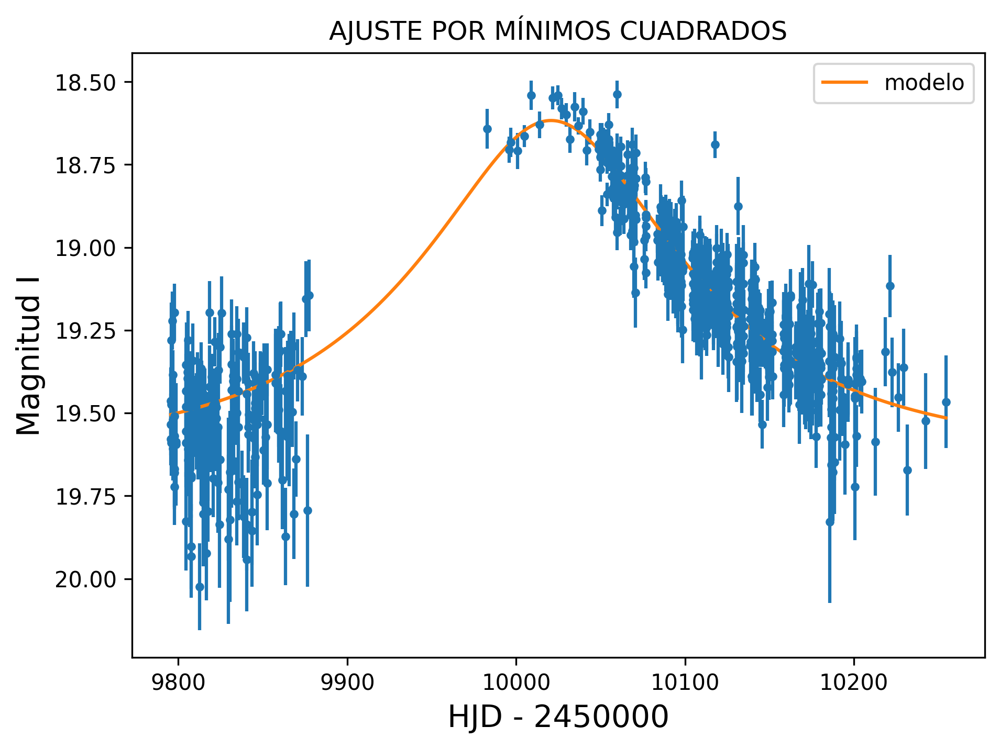
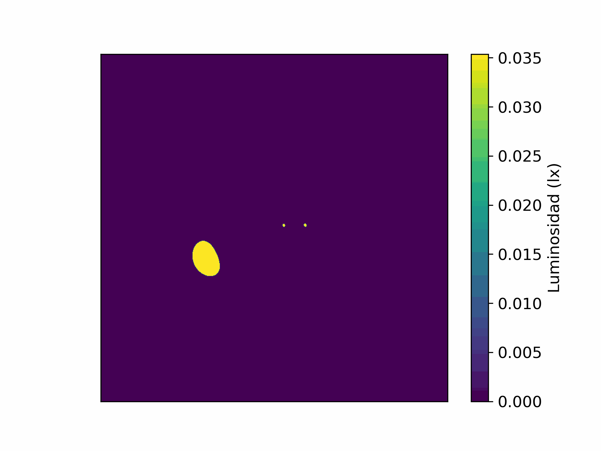
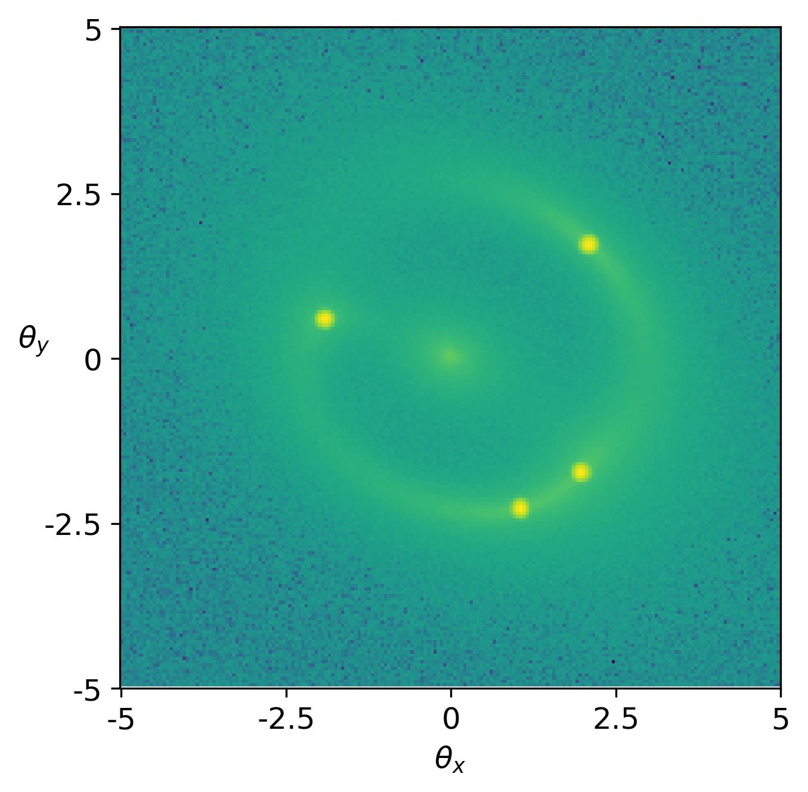

# Simulaciones
Para poder ejecutar los distintos códigos hay que instalarse diferentes paquetes:
1. Instalar *Numpy* y *Matplotlib*: `pip install matplotlib` y `pip install numpy`.
1. Instalar la librería *lenstronomy* y *lmfit*: `pip install lenstronomy` y `pip install lmfit`. 
## 1. Ajuste curva de luz
En el cuaderno  se encuentra explicado el ajuste de la curva de luz observada por el telescopio OGLE. El resultado es:
.

## 2. Lente binaria
En el cuaderno  se encuentra la simulación de la lente binaria. Entre otra cosas se puede simular la siguiente animación:

## 3. Lente extensa
En el cuaderno  se genera una imagen de una galaxia con un  cuásar en su centro para deformarla mediante una lente tipo *Sèrsic*. Se emplea también un algoritmo de reconstrucción paramétrica.

